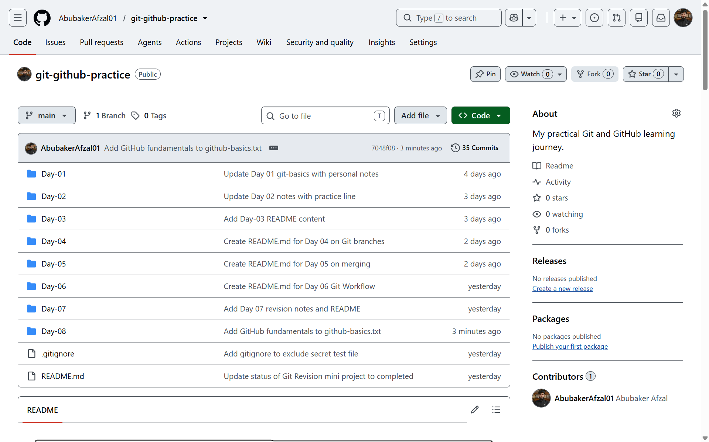
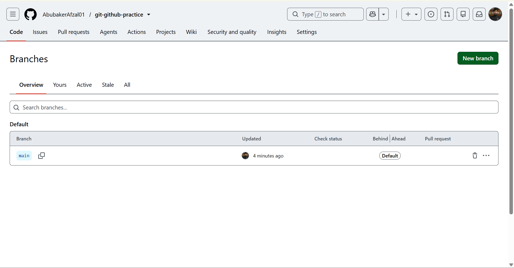
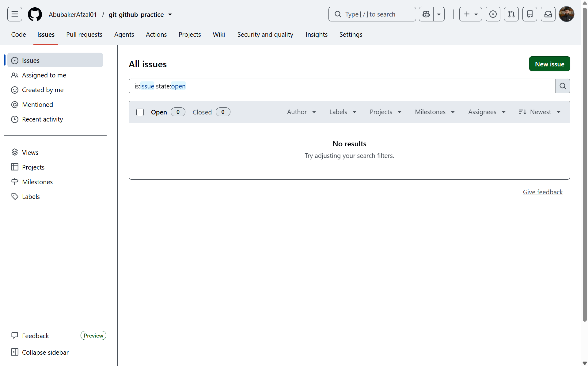

# Day 08 - GitHub Fundamentals

## What I Learned
- What GitHub is and how it relates to Git
- Exploring the Commits, Branches, and Issues tabs on GitHub
- GitHub only shows branches that have been explicitly pushed - local and remote are not automatically the same

## Screenshots

### Repository Overview

### Branches Tab
Only the main branch appears here - my local feature-day04 branch was never pushed to GitHub.

### Issues Tab
No issues yet - this will be used starting Day 12.

## Commands Practiced
- git show
- git log --oneline
- git branch
- git switch <branch> (correct syntax, after trying it without git)

## Key Takeaway
A branch created locally stays local until it is explicitly pushed to GitHub. Exploring GitHub's website (Commits, Branches, Issues tabs) showed the same history seen in the terminal, just presented visually.
